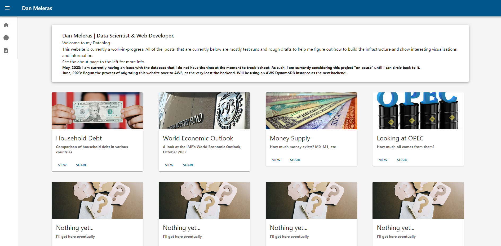

## Website V2
This was the second version of my website, where I had made a few dashboards/data visualizations using React & recharts. I loaded data into a Postgres database, and fed it to the front end via a Flask API. The Frontend, API and Database were all hosted on [Render](https://render.com/). 

I had begun moving it to AWS and switching to a NoSQL db. I also started messing with the dependencies to try to get a background going similar to what is on my website now, and somewhere along the way, I broke everything. At the time, I had been playing with a new frontend, and new formats, so I decided to run with one. This repository is the code for that version of the website.

Three repos below. They each have their own README's as well for more information.

#### /server
Contains the Flask API.

#### /website-v2
Frontend, built with React.

#### /data
Data engineering.

There are also a couple of bash scripts to get coding sessions going/ended.

Here's what it looked like:
